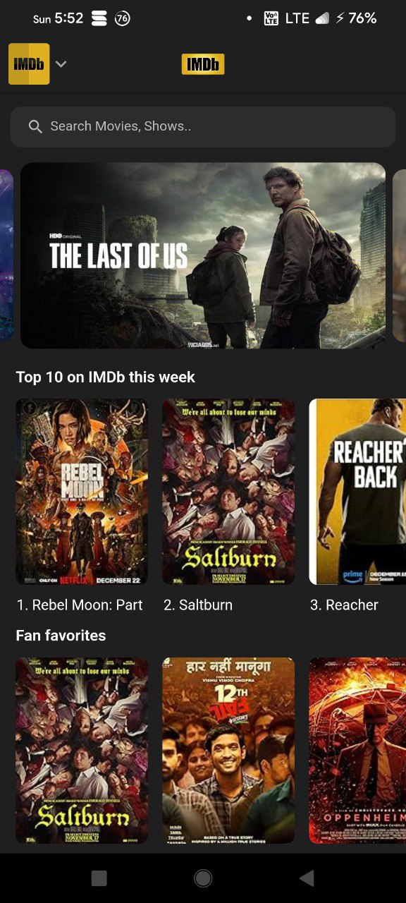

# IMDb Switch Bot

This bot provides information about IMDb releases, allows searching for content, and displays details about movies or shows.



## Setup Instructions

Follow these steps to set up and run the IMDb bot:

### Prerequisites

1. Ensure you have Python 3.10 or later installed.

2. Install the required Python packages:

   ```bash
   pip3 install -r requirements.txt
   ```


### Bot Token

1. Create a bot on Switch and obtain your bot token.
2. Update the script with your bot token:
3. fill it in `.env`

### Running the Bot

1. Execute the IMDb bot script:

   ```bash
   python app.py
   ```

2. Once the bot is running, start a conversation with your bot and use the "/start" command to begin.

## Bot Commands

- `/start`: Get the start message and open the app.


## Credits

- IMDb Switch Bot is powered by the SwiBots library.

```